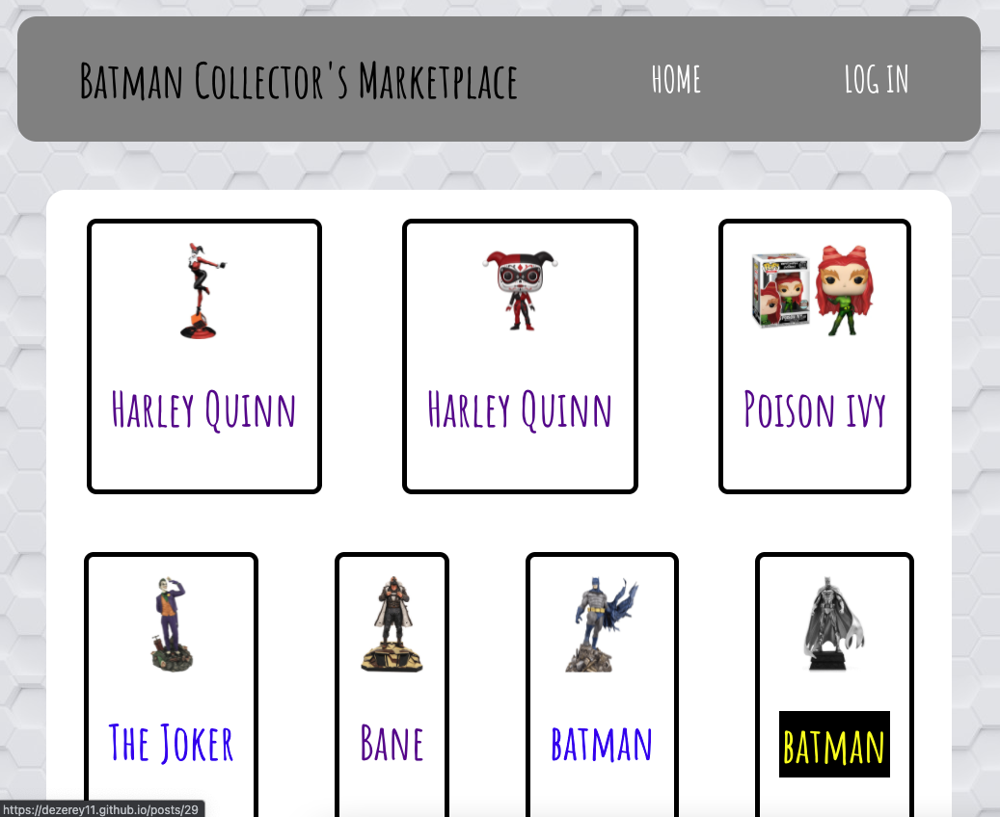
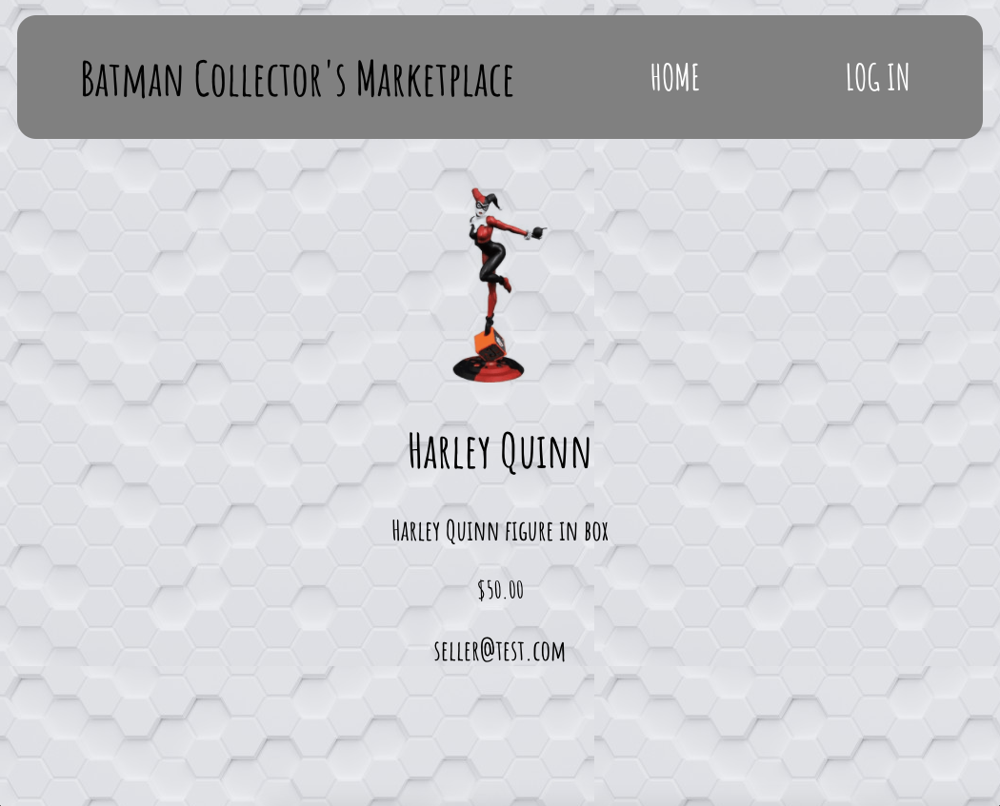
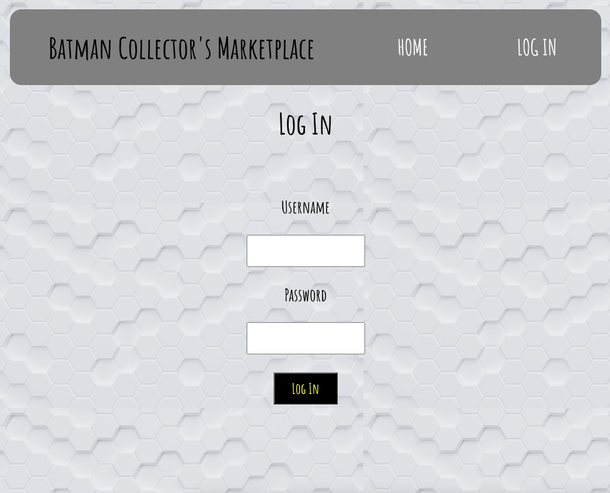
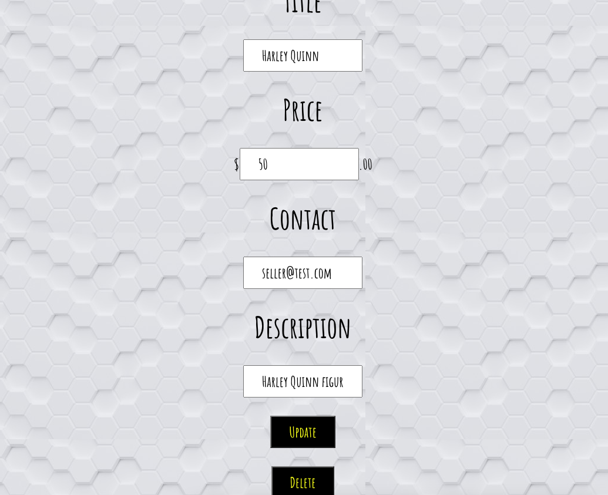
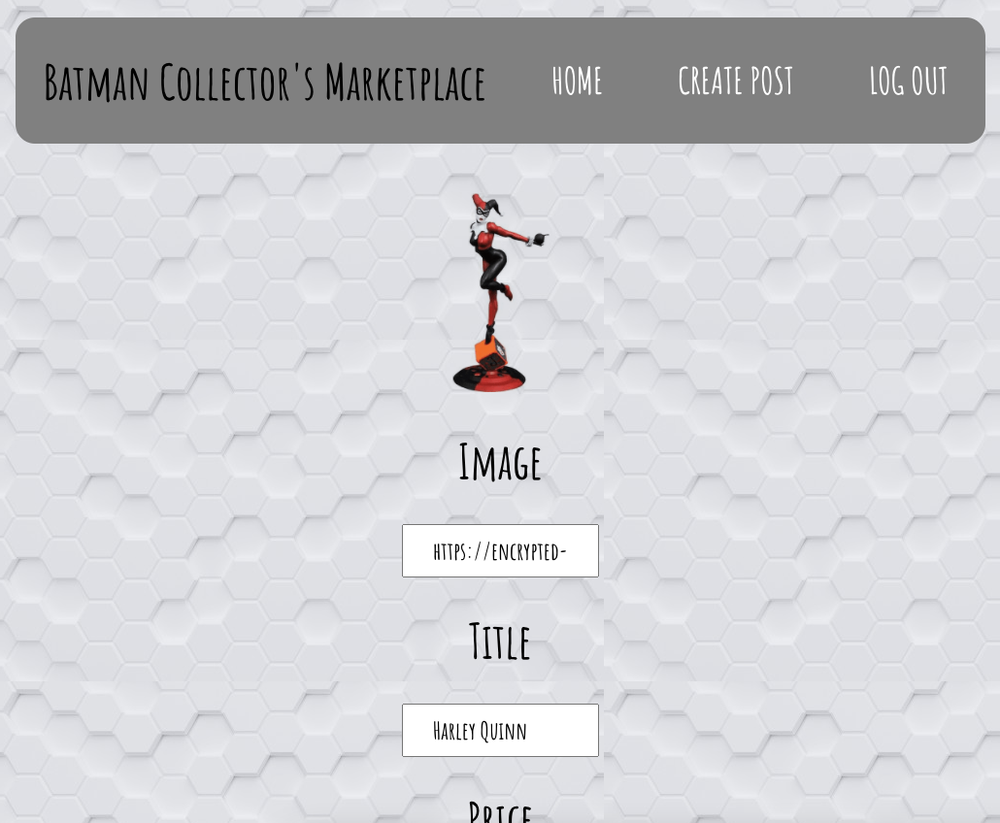

# BATMAN COLLECTOR’S MARKETPLACE

## LINK TO APP

https://dezerey11.github.io/project4-frontend/

## TECHNOLOGIES USED

- Javascript
- HTML
- CSS
- React

## APPROACH TAKEN

React was used to set up the frontend that took data from a Rails API in the backend. JSON Web Tokens (JWT) were used to authenticate the post owner and allow them to perform full CRUD operations. An unauthenticated user will only be able to view posts.

## UNSOLVED PROBLEMS/ FUTURE ENHANCEMENTS

- Prevent blank posts from being created
- Get new and updated posts to appear at the top of the screen
- Get new users to sign up and give them full CRUD operations on their posts

## SCREEN SHOTS

